# Crystal12

This is a mod of the [**Pokémon Crystal**](https://github.com/pret/pokecrystal) disassembly.

### TODO
- Add more birds to water routes, adjust encounter rate per size
- fix aerodactyl room flash bug
- Check if hardcoded quick claw and kings rock effects need to be removed
- Change Sleep to ATK drop
- Fix Item/Move Descriptions and NPC explanations
- Fix some night NPC sprites still being bright
- Add way to Toggle Run
- Use Lv50 for calculations, would still be used for new moves and evolutions and adjust Healing Items for Lv50
- Adjust AI for all changes

## Plus branch

- Removed RNG (Accuracy, Confusion, Damage Rolls, etc)
- Fixed weird TYPES (such as Psyduck not being PSYCHIC)
- Removed Leftovers Text
- Confusion always hits self but doesn't stop action
- Attract sharply lowers ATT and SPA
- Rampage always lasts 2 turns
- Freeze halves SPA
- Paralysis doesn't have random chance
- Sleep halves defenses. Rest fails if already asleep.
- Rapid Spin and Bone Rush give Speed UP
- Removed Flinch and OHKO
- Focus Band(ATT), King's Rock(DEF), Scope Lens(SAT), Brightpowder(SDE) and Quick Claw(SPE) give +1 boost in battle
- Stat Multipliers now match Acurracy Multipliers (x3 at +6 instead of x4)
- Removed Kanto trades for new ones in Cherrygrove, Cianwood and Mahogany
- Protect always fails on 2nd consecutive use
- Baton pass doesn't pass Status changes and Substitute. Teleport works the same but with reduced priority

### Type Changes
Ampharos/Flaaffy/Mareep: Electric/Normal
Arbok/Ekans: Poison/Dark
Azumarill/Marill: Water/Normal
Bellossom: Grass/Normal
Bellsprout: Grass/Grass
Blastoise: Water/Steel
Charizard: Fire/Dragon
Clefable/Cleffa/Clefairy: Normal/Psychic
Cloyster: Water/Dark
Dodrio/Doduo: Normal/Fighting
Dragonair: Dragon/Flying
Dunsparce: Ground/Dragon
Electabuzz: Electric/Fighting
Farfetch'd: Flying/Fighting
Fearow/Spearow: Flying/Flying
Girafarig: Dark/Psychic
Golduck/Psyduck: Water/Psychic
Golem/Geodude/Graveler: Rock/Rock
Granbull/Snubbull: Normal/Dark
Gyarados: Dragon
Ivysaur/Bulbasaur: Grass/Grass
Pupitar/Larvitar: Rock/Dark
Lapras: Ice/Dragon
Lugia: Water/Flying
Magmar: Fire/Fighting
Ninetales: Fire/Ghost
Noctowl: Psychic/Flying
Octillery/Remoraid: Water/Steel
Parasect: Ghost/Grass
Porygon2/Porygon: Normal/Ghost
Seel: Water/Ice
Slowpoke: Water/Water
Slowbro: Water/Ghost
Stantler: Normal/Ice
Sunflora: Grass/Fire
Victreebel: Grass/Dark
Bellsprout/Weepinbell: Grass/Grass
Yanma: Bug/Dragon

## Main branch

- No PHYSICAL/SPECIAL split
- No TYPE changes
- No new story or self-inserts
- Save compatibility with the original game
- 251 catchable
- GHOST-TYPE MOVES are now SPECIAL and DARK-TYPE MOVES are PHYSICAL
- Several MOVE POWER, ACCURACY and PP changes
- Base STAT buffs for some weak POKEMON
- Unique POKEMON icons(credits Chamber, Soloo993, Blue Emerald, Lake, Neslug, Pikachu25, Helfexen, LuigiTKO, FrenchOrange, Rangi42)
- DVs and EVs shown on STATUS page(credits KDLPro)
- Reworked learnsets and encounters, see POKEDEX(credits Nayru62)
- Many Bug fixes, QoL & balance changes(credits Idain, landesherr, Rangi42)

To set up the repository, see [INSTALL.md](INSTALL.md).

## Screenshots

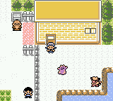
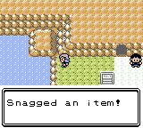
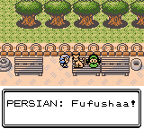
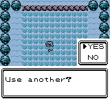

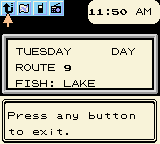
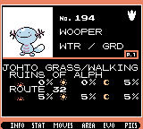
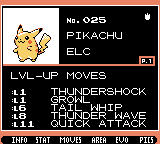
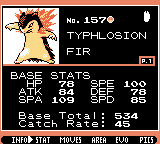

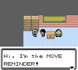
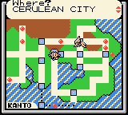
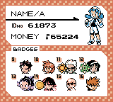
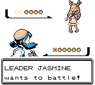

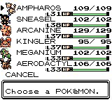
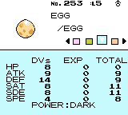
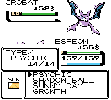
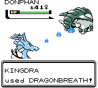
