# Crystal12

This is a mod of the [**Pokémon Crystal**](https://github.com/pret/pokecrystal) disassembly.

### TODO

- Lower level curve for Jasmine, Lighthouse probably can be higher though
- Make Sweet Scent target harder encounters
- Add a way to see current route encounters
- Revert double stat exp
- Add early Voltorb mimic encounter
- Move upgrade somewhere
- Make stat held items more scarce
- Change TMs
- Revert changed variable names
- Add more birds to water routes, adjust encounter rate per size
- Use Lv50 for calculations, would still be used for new moves and evolutions and adjust Healing Items for Lv50
- Adjust NPC explanations for moves and items
- Add a way to Toggle Run
- Adjust AI for all changes (atm spams haze and uses focus energy for no reason)
- Add Bike Shop back to Cerulean City
- https://github.com/fellowship-of-the-roms/pokecrystal/commits/Doublespeed-60fps-Running-Shoes/
- Adjust Marts
- Battle Tower lol

## Plus branch

- Removed battle RNG (Accuracy, Confusion, Full Para, Crit Chance, Damage Rolls, etc)
- Freeze lowers SPA
- Paralysis still lowers SPE
- Sleep lasts 3 turns and lowers DEF and SPD. Rest fails if already asleep.
- Attract sharply lowers ATT and SPA
- Confusion always hits self but doesn't stop action
- Rampage always lasts 2 turns
- Protect always fails on 2nd consecutive use
- Removed Flinch and OHKO moves
- Guaranteed Crit moves still bypass stat changes
- Held items repurposed to give +1 boost in battle
    Focus Band(ATT): Buena, Omanyte Item Room, Fighting Dojo, Tyrogue family
    King's Rock(DEF): Buena, Slowpoke Well, Slowpoke and Poliwag family
    Scope Lens(SAT): Buena, Omanyte Item Room, Hoothoot family
    Brightpowder(SDE): Buena, Dragonair Trade, Kanto Birds
    Quick Claw(SPE) : Buena, National Park, Sandshrew family and Sneasel
    Berserk Gene: Omanyte Item Room, Cerulean City, Mewtwo, Wobbuffet
- Stat Multipliers now match old Acurracy Multipliers (x3 at +6 instead of x4)
- Baton pass doesn't pass Status changes and Substitute. 
- Focus Energy cures status
- Silver Wing obtainable earlier, from Old Man in the Lake of Rage
- Removed Kanto trades for new ones in Cherrygrove, Cianwood and Mahogany
- Shiny check ignores ATK DV and also accepts 15 Speed (1/2048) from (1/8192)
- Optional badge based level cap for nuzlockes

### Type Changes

Arbok/Ekans: Poison/Dark
Bellsprout/Weepinbell: Grass/Grass
Blastoise: Water/Steel
Bulbasaur/Ivysaur: Grass/Grass
Charizard: Fire/Dragon
Cleffa/Clefairy/Clefable: Normal/Psychic
Cloyster: Water/Dark
Doduo/Dodrio: Fighting/Fighting
Dragonair: Dragon/Flying
Dunsparce: Ground/Dragon
Electabuzz: Electric/Fighting
Farfetch'd: Flying/Fighting
Geodude/Graveler/Golem: Rock/Rock
Girafarig: Dark/Psychic
Gyarados: Dragon/Dragon
Larvitar/Pupitar: Rock/Dark
Lapras: Ice/Dragon
Lugia: Water/Flying
Magmar: Fire/Fighting
Ninetales: Fire/Ghost
Noctowl: Psychic/Flying
Octillery/Remoraid: Water/Steel
Parasect: Ghost/Grass
Porygon2/Porygon: Normal/Ghost
Psyduck/Golduck: Water/Psychic
Seel: Water/Ice
Slowbro: Water/Ghost
Slowpoke: Water/Water
Snubbull/Granbull: Normal/Dark
Spearow/Fearow: Flying/Flying
Stantler: Normal/Ice
Sunflora: Grass/Fire
Victreebel: Grass/Dark
Yanma: Bug/Dragon

## Main branch

- No PHYSICAL/SPECIAL split
- No TYPE changes
- No new story or self-inserts
- Save compatibility with the original game
- 251 catchable
- GHOST-TYPE MOVES are now SPECIAL and DARK-TYPE MOVES are PHYSICAL
- Several MOVE POWER, ACCURACY and PP changes
- Base STAT buffs for some weak POKEMON
- Unique POKEMON icons(credits Chamber, Soloo993, Blue Emerald, Lake, Neslug, Pikachu25, Helfexen, LuigiTKO, FrenchOrange, Rangi42)
- DVs and EVs shown on STATUS page(credits KDLPro)
- Reworked learnsets and encounters, see POKEDEX(credits Nayru62)
- Many Bug fixes, QoL & balance changes(credits Idain, landesherr, Rangi42)

To set up the repository, see [INSTALL.md](INSTALL.md).

## Screenshots

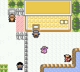
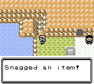
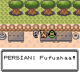
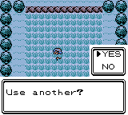

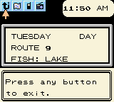
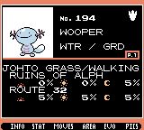
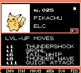
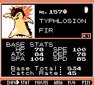

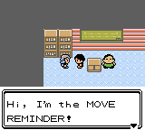
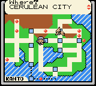
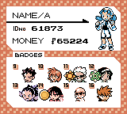
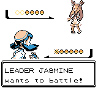

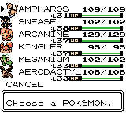
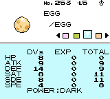
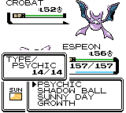
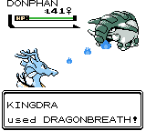
